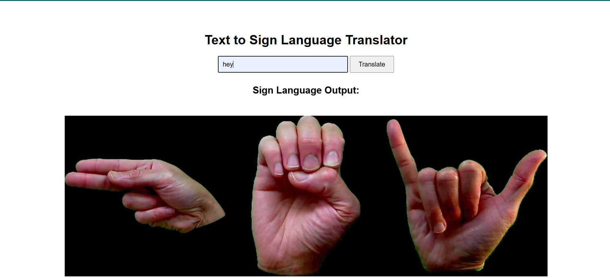

# 🧏‍♂️ Sign Language Visualizer

A simple Flask web application that converts an English sentence into a sequence of American Sign Language (ASL) gesture images using a preloaded image dataset.

---

## 📸 Demo

> 🔤 **Input**: `hey`  
> 🖼️ **Output**: 

---

## 🚀 Features

- ✅ Converts typed text to a visual strip of sign language gestures.
- ✅ Supports letters (`a-z`), numbers (`0-9`).
- ✅ Displays output image on the same page.
- ✅ Uses basic HTML, CSS, and Flask backend.

---

## 🧰 Tech Stack

- Python (Flask)
- HTML/CSS (Jinja2 templates)
- Pillow (PIL) – Image processing

---

